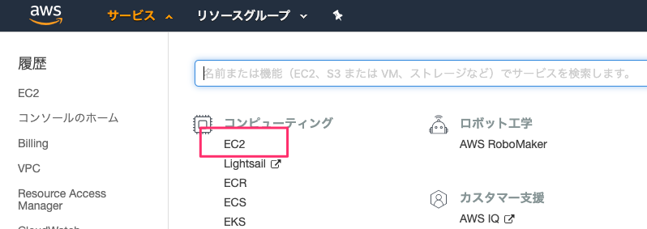
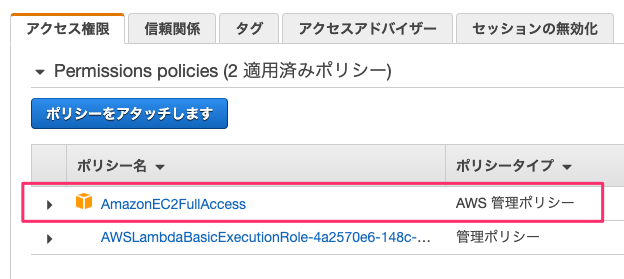
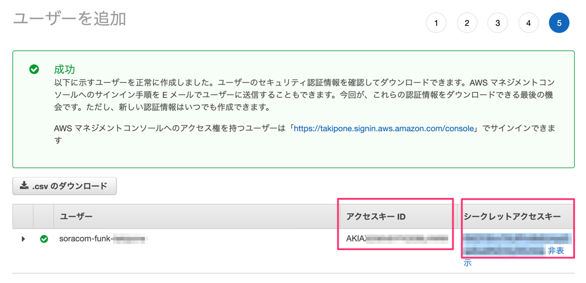

# ボタンで EC2 インスタンスを操る

<!--
Google Drive Images: 
-->

## 全体の構成

Key = `Button-de`, Value = `Go!` というタグが割り当てられている EC2 インスタンスを対象に、以下のボタンの動作で start_instances もしくは stop_instances してみます。

- シングル : 何もしない
- ダブル : インスタンス停止(stop_instances)
- ロング : インスタンス開始(start_instances)

### 注意

**本ハンズオンは他のインスタンスに影響がないことは検証済みではありますが、インスタンスの操作を伴う作業となるため適切なアカウントもしくはリージョンを選択するようにしてください。本作業によって発生した問題は免責させていただくことをご留意ください**

## 必要なもの

- AWS アカウント (持っていない場合の作成方法は [AWS アカウントの作成](create-aws-account){:target="_blank"} をご覧ください)
- SORACOM アカウント

## EC2 インスタンスを準備する

ここではボタンで操作するEC2インスタンスを作成します。

AWS Management Consoleにログインして画面右上のリージョン選択メニューをクリック、[アジアパシフィック(東京)]をクリックして東京リージョンを選択します。

続いて、画面上部の[サービス]メニューから [コンピューティング] - [EC2]を選択し、EC2の管理画面を表示します。



[インスタンスの作成] - [インスタンスの作成]ボタンをクリックし、インスタンスの作成ウィザードを開きます。

### ステップ 1: Amazon マシンイメージ (AMI)

AMI一覧から 「Amazon Linux 2 AMI (HVM), SSD Volume Type* >> **64 ビット (x86)**」が選択されていることを確認し、[選択]ボタンをクリック

### ステップ 2: インスタンスタイプの選択

インスタンスタイプ一覧から「**t2.micro (無料枠の対象)**」が選択されていることを確認し、[次のステップ: インスタンスの詳細の設定]ボタンをクリック

### ステップ 3: インスタンスの詳細の設定

[インスタンス数]を`3`に変更します。他の項目は初期値のまま、[次のステップ: ストレージの追加]ボタンをクリック

### ステップ 4: ストレージの追加

初期値のまま、[次のステップ: タグの追加]ボタンをクリック

### ステップ 5: タグの追加

[タグの追加]ボタンをクリックし、以下を入力します

- キー: `Button-de`
- 値: `Go!`

青い[確認と作成]ボタンをクリック

### ステップ 7: インスタンス作成の確認

[起動]ボタンをクリックします。「既存のキーペアを選択するか...」ダイアログが表示されるので、ドロップダウンメニューから「**キーペア無しで続行**」を選択し、「この AMI に組み込まれたパスワードがわからないと...」のチェックを付けて、青い[インスタンスの作成]ボタンをクリックします。

これでEC2インスタンス3台が起動するので、[インスタンスの表示]ボタンをクリックし、インスタンス一覧画面で3台のインスタンスが`pending`→`running`に変わり起動する様子を確認します。

### 確認

起動しているインスタンスを1つ選択し、[タグ]タブをクリックします。一覧からキーが「Button-de」、値が「Go!」になっていることを確認します。


これでEC2インスタンスの準備は完了です。

## AWS Lambda を準備する

画面上部の[サービス]メニューから [コンピューティング] - [Lambda]を選択し、AWS Lambdaの管理画面を表示します。

### 関数の作成

画面左側のメニューから[関数]をクリックしてLambda関数一覧を表示、右側の[関数の作成]ボタンをクリックして、以下のようにLambda関数を作成します。

- [一から作成]が選択されていることを確認
- 関数名に `ec2-instance-controller-by-button` と入力
- ランタイムを「**Python 3.7**」に変更
- 右下の[関数の作成]ボタンをクリック

### 関数の ARN をメモする

関数が作成され設定画面に切り替わったら、画面右上の[ARN]をコピーしておく(このあとのSORACOM Funkの設定時に利用します)。


### コード

[関数コード]内のエディタに表示されているコードを全て削除し、以下のコードをコピー&ペーストします。

```python
# FuncName: `ec2-instance-controller-by-button`
# Runtime: **Python 3.7**
BUTTON_OP_MAP = {
    'DOUBLE': 'stop',
    'LONG':   'start'
}

import boto3
ec2 = boto3.client('ec2')
def get_instance_ids(Key='Button-de', Value='Go!'):
    targetIds = []
    instances = ec2.describe_instances()
    for reservation in instances['Reservations']:
        for instance in reservation['Instances']:
            if 'Tags' in instance:
                for tag in instance['Tags']:
                    if tag['Key'] == Key and tag['Value'] == Value:
                        targetIds.append(instance['InstanceId'])
    return targetIds

def lambda_handler(event, context):
    print(event)
    targetIds = get_instance_ids()
    print("targetIds are {}".format(targetIds))

    try:
        invoke_method_name = "{}_instances".format(BUTTON_OP_MAP[event['clickTypeName']])
    except KeyError:
        print("Ignored (No Mapping)")
        return {'statusCode': 204}
    
    if targetIds:
        print("Invoke {}".format(invoke_method_name))
        getattr(ec2, invoke_method_name)(InstanceIds=targetIds) # It's black magic..
    return {'statusCode': 204}
```

### ポリシーの追加アタッチ

Lambda関数の実行ロールに、EC2インスタンスを操作するポリシーを追加します。

- 画面を下にスクロールし、[実行ロール] - [既存のロール]にある `ec2-instance-controller-by-button-role-<ランダム文字列>` ロールを表示のリンクをクリック
  
- IAM管理画面が表示されたら、[アクセス権限]タブ - [Permissions policies (1 適用済みポリシー)]の[ポリシーをアタッチします]ボタンをクリック
  
- 検索テキストボックスに`AmazonEC2FullAccess`と入力、表示される同名のポリシーの左にあるチェックボックスをオンにし、[ポリシーをアタッチ]ボタンをクリック
- [Permissions policies]に`AmazonEC2FullAccess`(EC2を操作する権限ポリシー)が追加されていることを確認
    
- IAM管理画面を閉じる

### 基本設定

[基本設定] - [タイムアウト]の秒数を`15`に変更します。

### テストイベントの作成

Lambda関数の設定画面に戻り、画面右上の[テスト]をクリックします。

イベント名に`SORACOMFunk`と入力、画面中央のエディタの内容を削除し、以下をペーストします。

```json
{
  "clickType": 1,
  "clickTypeName": "SINGLE",
  "batteryLevel": 1,
  "binaryParserEnabled": true
}
```

画面右下の[作成]をクリックします。Lambda関数の設定画面に戻ったら、画面右上の[保存]をクリックしLambda関数の設定を保存します。

### 動作確認

画面右上の[テスト]をクリックして、`SINGLE`(シングルクリック)イベントの動作を確認します。画面上部に「実行結果: 成功」が表示されるので[▼ 詳細]をクリックし[ログ出力]の中から後述のテストの出力サンプルが含まれることを確認します。

画面右上のテスト名「SORACOM Funk ▼」をクリック、[テストイベントの設定]からエディタ内の`clickTypeName` を `DOUBLE` や `LONG` に変更して[保存]をクリックし再度[テスト]をクリックして動作を確認します。それぞれ、「インスタンス停止」「インスタンス開始」と動作することを確認しましょう。

#### テストの出力サンプル:

##### `clickTypeName: "SINGLE"` の時

```
{'clickType': 1, 'clickTypeName': 'SINGLE', 'batteryLevel': 1, 'binaryParserEnabled': True}
targetIds are ['i-00143e861c65de56b', 'i-0e31228ddd9abf022', 'i-085caececdf653209']
Ignored (No Mapping)
```

##### `clickTypeName: "DOUBLE"` の時

```
{'clickType': 1, 'clickTypeName': 'DOUBLE', 'batteryLevel': 1, 'binaryParserEnabled': True}
targetIds are ['i-00143e861c65de56b', 'i-0e31228ddd9abf022', 'i-085caececdf653209']
Invoke stop_instances
```

##### `clickTypeName: "LONG"` の時

```
{'clickType': 1, 'clickTypeName': 'LONG', 'batteryLevel': 1, 'binaryParserEnabled': True}
targetIds are ['i-00143e861c65de56b', 'i-0e31228ddd9abf022', 'i-085caececdf653209']
Invoke start_instances
```

- ※ `clickType` や他の値は今回は利用しません。
- ※ 対象インスタンスの状態が running もしくは stopped の時に操作可能です。それ以外の時には ClientError が発生します。
- ※ この時、他のインスタンスに影響が無かったか確認するようにしてください。

## SORACOM Funk を設定する

ここではボタンをトリガーにLambdaを呼び出す SORACOM Funk を設定します。

### AWS IAM を準備する

Lambda関数を実行する権限を持つIAMユーザーを作成します。

AWS Management Consoleを表示し、画面上部の[サービス]をクリック、検索のテキストボックスに「IAM」と入力して表示される[IAM]を選択し、IAMの管理画面を表示します。

画面左のメニューから[ユーザー]を選択、[ユーザーを追加]ボタンをクリックして以下の通りIAMユーザーを作成します。

- [ユーザー詳細の設定]画面
    - ユーザー名 : `soracom-funk-test-<お名前>`
    - アクセスの種類 : [プログラムによるアクセス]のチェックをオン
- [アクセス許可の設定]画面
    - 「既存のポリシーを直接アタッチ」を選択
    - 検索テキストボックスに`AWSLambdaRole`と入力して表示される同名の「AWSLambdaRole」ロールのチェックボックスをオン
- 残りの項目は既定のまま[ユーザーの作成]ボタンをクリックしてIAMユーザーを作成

作成完了画面の「アクセスキー ID」と「シークレットアクセスキー」([表示]リンクをクリックして表示))を控えておきます。



### SORACOM Funk を設定する

作業Aで設定した`button`グループにSORACOM Funkを追加し、ボタンクリックからAWS Lambdaを呼びだせるようにします。

- SORACOM ユーザコンソールを表示し、画面左のメニューから[SIMグループ] - [`button`]をクリック
- [SORACOM Funk設定]を開き、以下を設定
    - スイッチをON
    - サービス: AWS Lambda
    - 送信データ形式：JSON
    - 認証情報 >> 認証情報を新規作成する...
        - 認証情報 ID: `aws-lambda-credential`
        - AWS Access Key ID: 手順「AWS IAM を準備する」で作成したIAMユーザーのアクセスキー ID
        - AWS Secret Access Key: 手順「AWS IAM を準備する」で作成したIAMユーザーのシークレットアクセスキー
    - 関数の ARN: 手順「AWS Lambda を準備する」でメモした関数のARN
    - [保存]をクリック

### 実際にやってみる

LTE-Mボタンを操作してみましょう。ダブルクリックで3台のインスタンスが停止、ロングクリックで3台のインスタンスが開始するはずです。

以上で本ページの作業は完了です。
