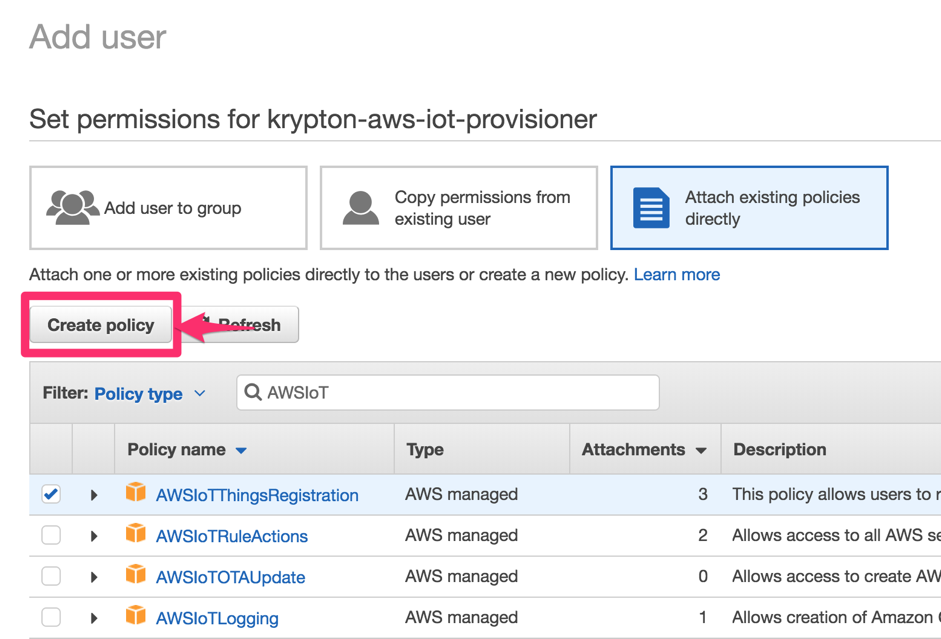
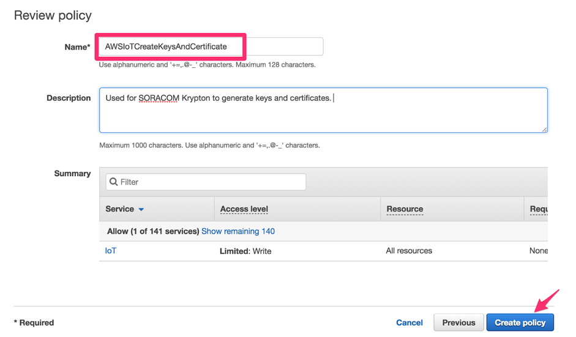
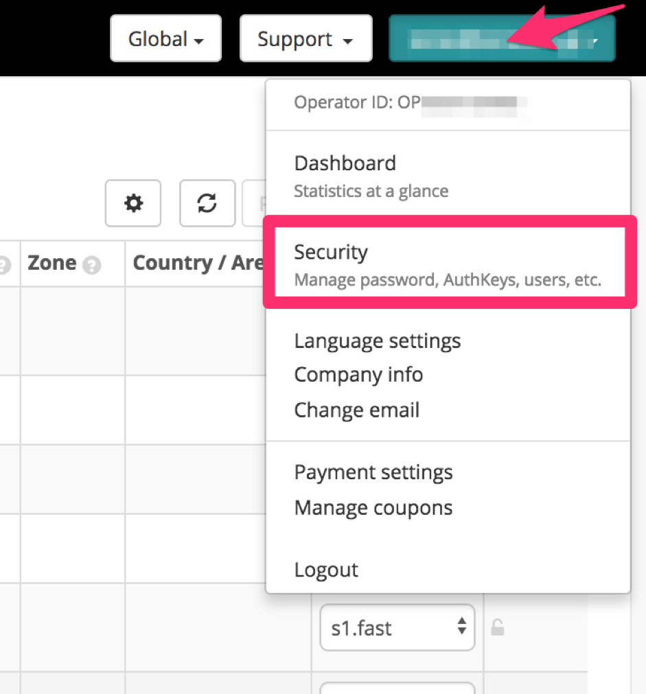
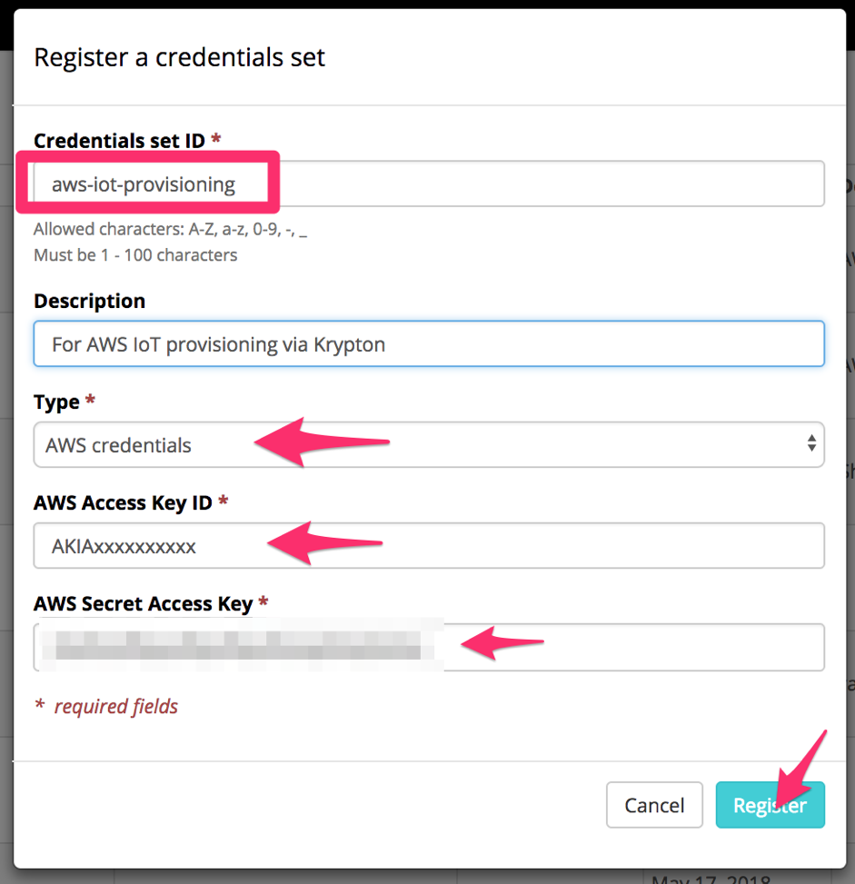
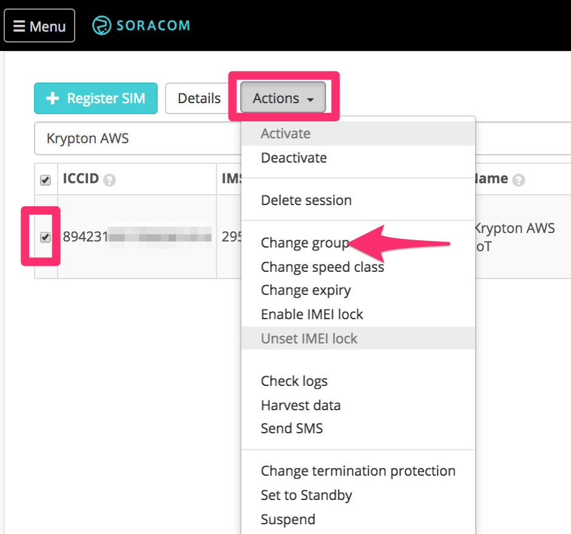
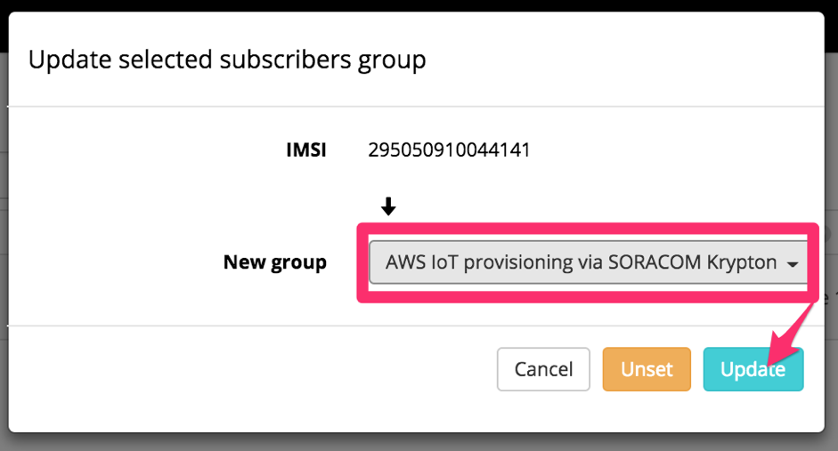

# SORACOM KryptonによるAWS IoT Coreへの自動登録

本ハンズオンでは、SORACOM Kryptonの登録代行機能を利用して、AWS IoT CoreのThingおよびx509証明書の代行登録の様子を確認します。

# 事前準備

- PC/Mac
  - AWS
    - Management Console(IAMユーザー)
    - IAMユーザーを作成する権限を行使できること
  - SORACOM
    - SAMユーザー
    - soracom-cli
    - クレデンシャル作成とグループ設定変更の権限を持つSAMユーザーを行使できること
  - jq

以下のソフトウェアをRaspberry Piに事前にインストールします

- mosquitto
- jq
- setup_air.shを実行しLTE接続できていること

# 1. 証明書を生成する権限を持つ AWS IAM 資格情報を作成する

SORACOM Krypton が thing を作成し、証明書を生成してポリシーを適用するには、適切な権限セットを持つAWS資格情報のセットが必要です。 ここでは、AWS IAMユーザーを作成し、AWS資格情報を取得します。

AWS IAM コンソールを表示します。


「ユーザー」メニューから「ユーザーを追加」をクリックします。


ユーザー名を入力し、「プログラムによるアクセス」にチェックをつけ「次のステップ：アクセス権限」をクリックします。


「既存のポリシーを直接アタッチ」を選択します。
「AWSIoTThingsRegistration」を検索してチェックします。


「ポリシーの作成」をクリックします。




「IoT」を対象サービスとして選択し [CreateKeysAndCertificate] のチェックボックスを有効にし、 「Review Policy」をクリックします。


名前を入力して「Create policy」をクリックします。



「ユーザーを追加」ウィザードに戻り、最後のステップで作成したポリシーを探します（更新ボタンをクリックする必要があります）。チェックボックスをクリックし、 「次のステップ：確認」をクリックします。


内容を確認し、「ユーザーの作成」をクリックします。


AWSアクセスキーIDとシークレットキーの両方をコピーして、保存します。（AWSシークレットアクセスキーはこの時点で一度だけ表示されます）
  


## 2-1. SORACOM Krypton を設定する

次に、SIM が AWS IoT Coreをプロビジョニングするために IoT SIM グループを設定します。 SORACOM 認証情報ストアにエントリを作成し、資格情報IDとAWS IoT関連のパラメータをグループコンフィグレーションで設定します。

### SORACOM 認証情報ストアに AWS 資格情報を登録する

SORACOM ユーザーコンソールから、右上のオペレータメニューから「セキュリティ」を選択します。



認証情報ストアから「認証情報を登録」を選択します。


認証情報セットに名前を付け、タイプとして「AWS credentials」を選択します。前のセクションで作成した AWS 認証情報を入力します。




### グループコンフィグレーションを作成し、SIM をグループに所属させます。

SORACOM ユーザーコンソールから SIM グループを表示します。


「追加」ボタンをクリックしてグループを作成します（または既存のグループを使用する場合はグループを選択します）。


グループをクリックし、グループ設定ビューに移動します。


SIMグループに AWS IoT 情報を設定します。

「ステップ1」と「ステップ2」で設定した内容から、次のようにグループを設定します

- AWS リージョン: `ap-northeast-1`を入力
- 認証情報: 当ステップで作成した AWS IoT 用の認証情報を選択します。
- Policy name: 新しく作成された証明書に割り当てるポリシー名を入力します。
- Thing name pattern: クライアントが指定していない場合に使用する Thing name を入力します。 Thing name には `$imsi` という文字列を含める必要があります。`$imsi` はアクセス元の SIM の IMSI に置換されます。
- ルート認証局証明書: ルート認証局証明書を入力します。(入力はオプションです。)

SORACOMユーザーコンソールの「SIM 管理」メニューに移動します。


対象の SIM を選択し「アクション」メニューから「所属グループ変更」をクリックしてください。



グループを選択し、 「更新」をクリックしてください。



# 3. Krypton を使用して Thing を作成し、デバイスを接続する

ここまでで、IoT SIM および Krypton を使用してデバイスをプロビジョニングする設定を行いました。次にデバイスを起動して、MQTTSによってAWS IoTに接続します。

```bash
$ curl -X POST https://krypton.soracom.io:8036/v1/provisioning/aws/iot/bootstrap
```