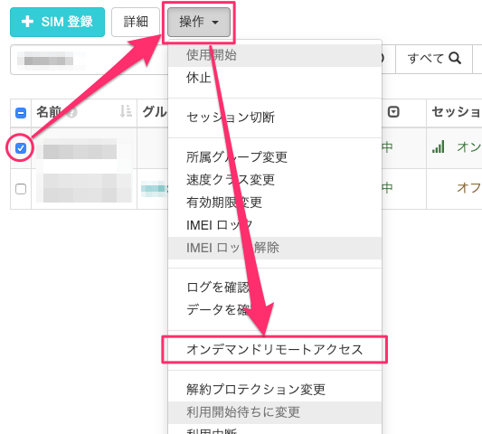
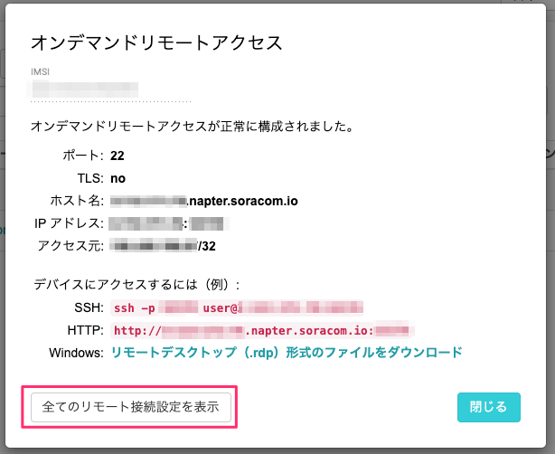

# SORACOM Napter を使用して、 IP ベースの遠隔操作

本章では SORACOM Napter を使用して PC から SORACOM Air SIM への遠隔操作を行います。

## ハンズオンのゴール

遠隔操作用の PC から、 Raspberry Pi に SSH でログインし、Raspberry Pi 内の設定を変更します。

## SORACOM Air SIM に SORACOM Napter を設定する

NapterでSSH(22番ポート)にリモートアクセスする設定を以下の手順で追加します。

SORACOM ユーザーコンソールの左上 [Menu] から [SIM 管理] をクリックして自分のSIMのチェックボックスをオンにし、 「操作」 - 「オンデマンドリモートアクセス」を選択します。



「オンデマンドリモートアクセス」画面では、リモートアクセスするデバイス側ポートの接続設定やリモートアクセスを許可するアクセス元IPアドレス帯域などを設定します。今回はSSHのポート番号 `22` 、接続時間30分(どちらも既定値)のまま [OK] をクリックします。


画面が切り替わり「オンデマンドリモートアクセスが正常に構成されました」とメッセージが表示されたら、 [全てのリモート接続設定を表示] ボタンを押します。



オンデマンドリモートアクセス画面に表示される22番ポートの [アクセス] 列にあるホスト名(`xx-xx-xx-xx.napter.soracom.io`)と5桁のポート番号をそれぞれメモしておきます。


[閉じる] ボタンをクリックし設定ダイアログを閉じます。

## 遠隔操作用の PC からログインする

遠隔操作用の PC から、Raspberry Pi に SSH でログインしてみましょう。  

**メモした IP アドレス、アクセスポート番号が必要となります。**

### SSH でログインして Raspberry Pi の LED を制御する

SORACOM Air SIM 経由で SSH ログインをし、ログイン先 Raspberry Pi の LED を制御してみましょう。

他の端末から、自分の Raspberry Pi にログインします。  
※ 以下は macOS の場合です。Windows の場合は TeraTerm 等でメモしたホスト名とポート番号、ユーザー名 `pi` 、パスワード `raspberry` でログインしてください

```console
ssh -p <アクセスポート番号> pi@<ホスト名>
# セキュリティの警告が表示されたら yes と入力
# 続いて pi ユーザーのログインパスワードを聞かれたら、 raspberry と入力
```

ログインができたら、以下のコマンドでログイン先の Raspberry Pi の赤色 LED を点滅させます。

```console
echo heartbeat | sudo tee /sys/class/leds/led1/trigger
```

ログイン先の Raspberry Pi の 赤色 LED の点滅が始まったことを確認してください。  
点滅を停止する時は以下のコマンドになります。

```console
echo input | sudo tee /sys/class/leds/led1/trigger
```

`exit` コマンドを実行して一度ログアウトし、Napterの設定を削除します。

```console 
exit
```

自分のSIMのチェックボックスをオンにし、 「操作」 - 「オンデマンドリモートアクセス」を選択、22番ポートの設定にある [削除] ボタンをクリックし設定を解除します。

端末から先ほどのホスト名/ポート番号にログインを試し、設定が解除されているため接続できなくなっていることを確認します。

```console
ssh -p <アクセスポート番号> pi@<ホスト名>
# 接続がタイムアウトし、接続に失敗
```

再度Napterを設定し、SSH接続を行います。

自分のSIMのチェックボックスをオンにし、 「操作」 - 「オンデマンドリモートアクセス」を選択し、今回はSSHのポート番号 `22` 、接続時間は「2時間」を選択し [OK] をクリックします。設定できたら表示されたホスト名、ポート番号で再度接続します。

```console
ssh -p <アクセスポート番号> pi@<ホスト名>
# セキュリティの警告が表示されたら yes と入力
# 続いて pi ユーザーのログインパスワードを聞かれたら、 raspberry と入力
```

※ 次の手順もSSH接続を引き続き利用するため、ログインしたままにしておいてください。

これでリモートからSORACOM Air SIM への IP による遠隔操作が確認できました。

## 以上で本章は終了です

* [目次ページへ戻る](index.md)
