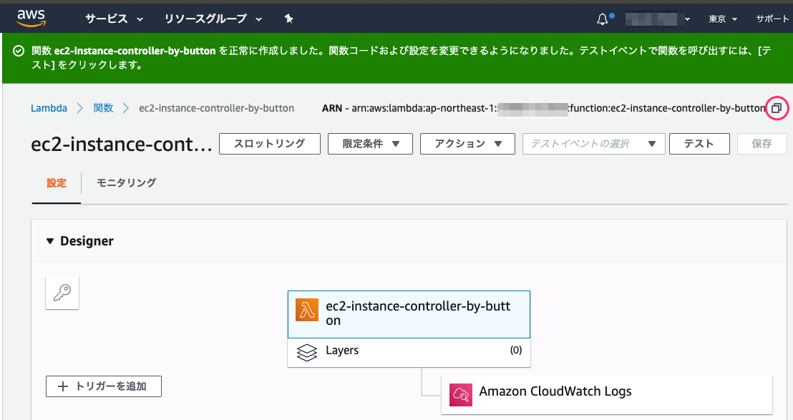

# SORACOM Funk を使用した AWS Lamdbaの連携

本章では SORACOM Funk を使用して Raspberry Piから AWS Lambda を連携します。

## ハンズオンのゴール

Raspberry Piから Funk にリクエストを送信し、 AWS Lambda関数を実行します。

## 1. AWS Lambda を準備する

AWS Managent Console 表示し、画面上部の[サービス]メニューから [コンピューティング] - [Lambda]を選択し、AWS Lambdaの管理画面を表示します。

### 関数の作成

画面左側のメニューから[関数]をクリックしてLambda関数一覧を表示、右側の[関数の作成]ボタンをクリックして、以下のようにLambda関数を作成します。

- [一から作成]が選択されていることを確認
- 関数名に `soracom-funk-test-<お名前>` と入力
- ランタイムを「**Python 3.7**」に変更
- 右下の[関数の作成]ボタンをクリック

### 関数の ARN をメモする

関数が作成され設定画面に切り替わったら、画面右上の[ARN]をコピーしておく(このあとのSORACOM Funkの設定時に利用します)。



### コード

[関数コード]内のエディタに表示されているコードを全て削除し、以下のコードをコピー&ペーストします。

```python
# FuncName: `soracom-funk-test`
# Runtime: **Python 3.7**
import json
import os
import pprint

def lambda_handler(event, context):
    print('event: ')
    print(event)
    print('context: ')
    pprint.pprint(context.client_context.custom)

    return 'simple response'
```

### テストイベントの作成

Lambda関数の設定画面に戻り、画面右上の[テスト]をクリックします。

イベント名に`SORACOMFunk`と入力、画面中央のエディタの内容を削除し、以下をペーストします。

```json
{
  "uptime": 100.00
}
```

画面右下の[作成]をクリックします。Lambda関数の設定画面に戻ったら、画面右上の[保存]をクリックしLambda関数の設定を保存します。

### Lambdaの動作確認

画面右上の[テスト]をクリックして、`SINGLE`(シングルクリック)イベントの動作を確認します。画面上部に「実行結果: 成功」が表示されるので[▼ 詳細]をクリックし[ログ出力]の中に以下のような出力が含まれることを確認します。

```
{'clickType': 1, 'clickTypeName': 'SINGLE', 'batteryLevel': 1, 'binaryParserEnabled': True}
targetIds are ['i-00143e861c65de56b', 'i-0e31228ddd9abf022', 'i-085caececdf653209']
Ignored (No Mapping)
```

## 2. SORACOM Funk の設定

## 2-1. AWS IAM を準備する

Funkから呼び出すために、Lambda関数を実行する権限を持つIAMユーザーを作成します。

AWS Management Consoleを表示し、画面上部の[サービス]をクリック、検索のテキストボックスに「IAM」と入力して表示される[IAM]を選択し、IAMの管理画面を表示します。

画面左のメニューから[ユーザー]を選択、[ユーザーを追加]ボタンをクリックして以下の通りIAMユーザーを作成します。

- [ユーザー詳細の設定]画面
    - ユーザー名 : `soracom-funk-test-<お名前>`
    - アクセスの種類 : [プログラムによるアクセス]のチェックをオン
- [アクセス許可の設定]画面
    - 「既存のポリシーを直接アタッチ」を選択
    - 検索テキストボックスに`AWSLambdaRole`と入力して表示される同名の「AWSLambdaRole」ロールのチェックボックスをオン
- 残りの項目は既定のまま[ユーザーの作成]ボタンをクリックしてIAMユーザーを作成

作成完了画面の「アクセスキー ID」と「シークレットアクセスキー」([表示]リンクをクリックして表示))を控えておきます。


### 2-2. SIMグループの作成とSIMの割り当て

SIMグループで SORACOM Funk を有効にします。まだSIMグループを作成していない場合は以下の手順で作成してください。作成済みの場合は手順2-3に進んでください。

[SORACOM Webコンソール](https://console.soracom.io/) で 左上[Menu] > [SIM グループ]をクリックします


[追加] で、SIMグループを作成します。グループ名は`handson-<お名前>`と入力します。


続いて、SIMグループにSIMを追加します。左上[Menu] > [SIM 管理]をクリックします


SIM を選択 > [操作] > [所属グループ変更]をクリックします


先ほど作成した SIMグループ に SIM を所属させます


SIM の "グループ" が、先ほど作った SIM グループ名になっていれば成功です

### 2-3. SORACOM Funkの有効化

グループにSORACOM Funkを追加し、ボタンクリックからAWS Lambdaを呼びだせるようにします。

- [SORACOM Funk設定]を開き、以下を設定
    - スイッチをON
    - サービス: AWS Lambda
    - 送信データ形式：JSON
    - 認証情報 >> 認証情報を新規作成する...
        - 認証情報 ID: `handson-aws-lambda-<お名前>`
        - AWS Access Key ID: 手順2-1で作成したIAMユーザーのアクセスキー ID
        - AWS Secret Access Key: 手順2-1で作成したIAMユーザーのシークレットアクセスキー
    - 関数の ARN: 手順1でメモした関数のARN
    - [保存]をクリック

## 3. 動作確認

Raspberry Piで以下のコマンドラインを実行し、SORACOM Funkにリクエストを送ります。レスポンスとしてLambda関数の戻り値が返っていることを確認します。

```console
$ cat /proc/uptime | cut -d ' ' -f 1 | echo '{"uptime": '$(cat)'}' | curl -X POST http://uni.soracom.io -d @-

```
```


以上で本ページの作業は完了です。

## 以上で本章は終了です

* [目次ページへ戻る](index.md)
