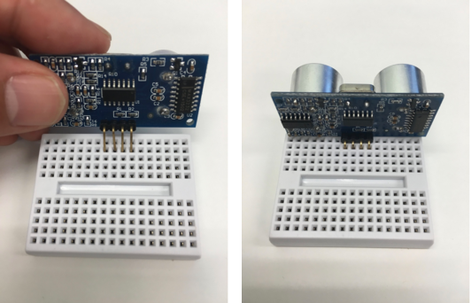
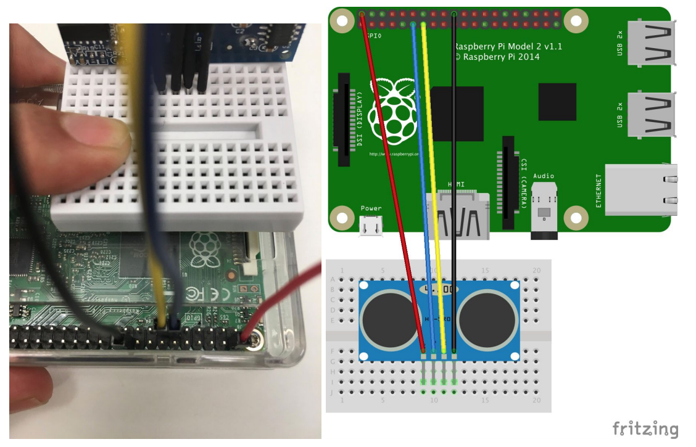

## 5 章 超音波センサーを使って距離を計測する

#### 超音波センサーの動作原理

超音波の反射時間を利用して非接触で測距するモジュールです。外部からトリガパルスを入力すると超音波パルス（８波）が送信され、出力された反射時間信号をマイコンで計算することによって距離を測ることができます。


具体的にはセンサーの `Trig` ピンにパルス(短い時間)電圧をかけて測定を開始し、`Echo` ピンが `HIGH` である時間の長さを計測します。

#### 配線

1.  必要なパーツが揃っているか確認しましょう

    - 超音波センサー HC-SR04 (スピーカのような形の青い基板)
    - ブレッドボード (穴がたくさん空いた白い板)
    - ジャンパーコード (オス-メス/赤黒黄青の４本)

      

2.  最初に、センサーをブレッドボードに刺します。端から２列目に刺すと安定します。

    

3.  ジャンパーコードを刺していきます。センサーの表面の `VCC` から `GND` の順に、赤・青・黄・黒を使ってください。

    

4.  ラズパイにケーブルを刺します

    - 刺すピンを間違えると故障の原因になるので、十分気をつけてください。
    - 赤いケーブルを最後に接続してください。

      

#### センサーをテストしてみる

以下のコマンドで、センサーのテスト用プログラムをダウンロード・実行し、正しくセンサー値が読み出せるか試しましょう。センサーの前に手をかざして数値が変化することを確認してください。

```console
pi@raspberrypi ~ $ curl -O http://soracom-files.s3.amazonaws.com/sensor_test.py
  % Total    % Received % Xferd  Average Speed   Time    Time     Time  Current
                                 Dload  Upload   Total   Spent    Left  Speed
100  1641  100  1641    0     0   2171      0 --:--:-- --:--:-- --:--:--  2170

pi@raspberrypi ~ $ python sensor_test.py
距離: 38.6 cm
距離: 38.9 cm
距離: 2.3 cm
     :
```

プログラムを終了するには `Ctrl-C` を押してください。

#### トラブルシュート

- 何も出力されない場合は接続するジャンパーコードの接続と色を確認してください。
